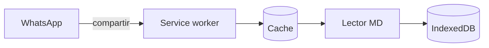
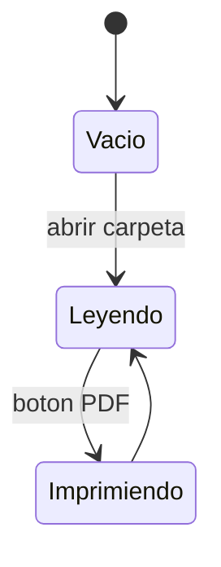

# Lector MD — documento de ejemplo

Este archivo es el manual y la demostración al mismo tiempo. En cada sección
aparece primero **cómo se escribe** algo, en un recuadro con el texto tal cual
va en el archivo, y después **cómo se ve** en el lector.

Si lo estás leyendo en GitHub, algunos resultados se van a ver distinto: esa es
justamente la gracia. Descargalo y abrilo en el lector.


[TOC]

## Qué es esto

Un lector de archivos Markdown que funciona **sin internet** y **sin subir nada
a ningún lado**. El archivo se lee en tu propia máquina y se muestra ahí mismo.

Es un solo `index.html`. No hay servidor que procese tus documentos, no hay
cuenta, no hay sincronización. Podés copiar ese único archivo a un pendrive y
leer tus `.md` en cualquier computadora con navegador.

Instalado como app tiene dos cosas más:

- En **Android** aparece en el menú *Compartir*: mandás un `.md` desde WhatsApp,
  Drive o el explorador y se abre acá.
- En **escritorio** aparece en *Abrir con*.

## Todo lo que hace, de un vistazo

| | |
|---|---|
| **Abrir** | una carpeta entera con sus subcarpetas, archivos sueltos, o arrastrando y soltando |
| **Desde otras apps** | en Android por el menú *Compartir*; en escritorio, por *Abrir con* |
| **Markdown** | encabezados, listas anidadas, tablas, código, citas, énfasis, enlaces |
| **Fórmulas** | con KaTeX si hay conexión, en Unicode si no |
| **Diagramas** | con Mermaid, que se baja sólo si el archivo tiene alguno |
| **Código** | con colores para JavaScript, TypeScript, Python, HTML, CSS, Java, C y C# |
| **Gráficos** | de barras, de líneas, de área, de dispersión y de torta, a partir de una tabla de datos escrita en el archivo |
| **Navegar** | índice de secciones en el panel lateral, tabla de contenidos dentro del documento con `[TOC]`, y `Alt`+`J` / `Alt`+`K` entre archivos |
| **Buscar** | dentro del documento abierto, desde dos caracteres, con resaltado |
| **Imprimir** | o guardar en PDF, con estilos propios para papel |
| **Ver** | tema claro u oscuro, interlineado cómodo o compacto |
| **Idioma** | español o inglés, según el navegador, con un botón para cambiarlo |
| **Recordar** | qué archivos cargaste, cuál leías y en qué parte de cada uno |
| **Funcionar** | sin conexión, sin servidor, con un solo archivo que podés llevar a cualquier lado |
| **Actualizarse** | sola, sin perder lo que tenías abierto |

## Cómo abrir archivos

### Desde la app

Tenés tres caminos, todos equivalentes:

1. **Abrir carpeta** — elegís una carpeta entera y lista todos los `.md` que haya
   adentro, incluidos los de subcarpetas. Es la opción recomendada.
2. **Abrir archivos sueltos** — elegís uno o varios archivos puntuales.
3. **Arrastrar y soltar** — tirás los archivos sobre la zona de lectura.

En pantallas chicas el panel lateral se esconde; el botón **☰** de la barra
superior lo abre.

### Desde otra app, en el celular

En el chat o en el explorador, tocá el ícono de **compartir** del archivo y
elegí **Lector MD** en la lista.

> Es **compartir**, no *abrir con*. En Android, Chrome no implementa la API que
> haría falta para aparecer en *abrir con*, así que el camino es el otro.

## Qué entiende del Markdown

Cada ejemplo tiene dos partes: el recuadro con el texto tal como se escribe en
el archivo y, debajo de **Se ve así**, el resultado.

### Texto

~~~markdown
Se puede poner *cursiva* con asteriscos o _con guiones bajos_, **negrita**,
***negrita y cursiva*** juntas, ~~texto tachado~~ y `código en línea`.
~~~

Se ve así:

Se puede poner *cursiva* con asteriscos o _con guiones bajos_, **negrita**,
***negrita y cursiva*** juntas, ~~texto tachado~~ y `código en línea`.

Los párrafos se separan con una línea en blanco. Un salto de línea suelto
**no** corta el párrafo: las líneas se unen, como en el Markdown clásico. Por
eso las dos líneas del ejemplo se ven como una sola.

### Citas

~~~markdown
> Una cita ocupa su propio bloque y puede tener **formato adentro**.
~~~

Se ve así:

> Una cita ocupa su propio bloque y puede tener **formato adentro**.

### Separadores

Tres guiones solos en una línea dibujan una raya horizontal:

~~~markdown
---
~~~

Se ve así:

---

### Encabezados

~~~markdown
# Título del documento
## Sección
### Subsección
~~~

Van de `#` a `######`: cuantos más numerales, más chico el título. No hay un
resultado aparte porque los títulos de este mismo documento están escritos
así; este, por ejemplo, lleva `###`.

Los de nivel 1 a 3 arman el índice **En este archivo** del panel lateral y la
tabla de contenidos que se explica a continuación.

### Tabla de contenidos

~~~markdown
[TOC]
~~~

Escribí `[TOC]` solo en una línea, donde quieras que aparezca. Ahí se arma la
lista de encabezados de nivel 1 a 3, con un enlace a cada sección. El resultado
es el **Contenido** que está al principio de este archivo.

Si el documento tiene un único `#`, se toma como el título y no se lista.
También sirve `[[_TOC_]]`, como en GitLab. A diferencia del índice del panel
lateral, la tabla de contenidos sale impresa.

### Listas

~~~markdown
- Un ítem
- Otro ítem
  - Anidado un nivel
  - Otro anidado
- Vuelta al primer nivel

1. Primer paso
2. Segundo paso
   1. Subpaso
   2. Otro subpaso
3. Tercer paso
~~~

Se ve así:

- Un ítem
- Otro ítem
  - Anidado un nivel
  - Otro anidado
- Vuelta al primer nivel

1. Primer paso
2. Segundo paso
   1. Subpaso
   2. Otro subpaso
3. Tercer paso

Las viñetas aceptan `-`, `*` o `+`, y las numeradas `1.` o `1)`.

### Tablas

~~~markdown
| Elemento | Sintaxis | Aparece en el índice |
|---|---|---|
| Encabezado | `#` a `######` | niveles 1 a 3 |
| Cita | signo mayor | no |
| Fórmula | `$$` o valla `math` | no |
~~~

Se ve así:

| Elemento | Sintaxis | Aparece en el índice |
|---|---|---|
| Encabezado | `#` a `######` | niveles 1 a 3 |
| Cita | signo mayor | no |
| Fórmula | `$$` o valla `math` | no |

La fila de guiones debajo del encabezado es obligatoria. Las tablas anchas
scrollean solas en horizontal.

### Código

Con vallas de tres acentos graves. Si le ponés el lenguaje al lado, se
resaltan las palabras clave, los textos, los números y los comentarios:

~~~markdown
```python
def promedio(valores):
    """Devuelve el promedio, o None si la lista está vacía."""
    if not valores:
        return None
    return sum(valores) / len(valores)
```
~~~

Se ve así:

```python
def promedio(valores):
    """Devuelve el promedio, o None si la lista está vacía."""
    if not valores:
        return None
    return sum(valores) / len(valores)
```

Estos son los lenguajes con colores y cómo se escribe cada uno:

| Lenguaje | Al lado de la valla |
|---|---|
| JavaScript | `js`, `javascript`, `json` |
| TypeScript | `ts`, `typescript` |
| Python | `py`, `python` |
| HTML y XML | `html`, `xml`, `svg` |
| CSS | `css` |
| Java | `java` |
| C | `c`, `h` |
| C# | `cs`, `csharp`, `c#` |

Los colores los pone **Prism**, que pesa unos 33 KB y se baja la primera vez
que abrís un archivo con código de alguno de estos lenguajes; después queda
guardado. Siguen el tema del lector y al imprimir salen con los del tema
claro. Sin conexión, o con cualquier otro lenguaje, el bloque se ve igual pero
en un solo color.

También sirve un bloque indentado con cuatro espacios, que queda sin colores:

~~~markdown
    esto también es código
    por estar indentado
~~~

Se ve así:

    esto también es código
    por estar indentado

### Fórmulas

Las fórmulas **en línea** van entre signos pesos, dentro de una oración:

~~~markdown
La energía en reposo es $E = mc^2$.
~~~

Se ve así:

La energía en reposo es $E = mc^2$.

Las fórmulas **de bloque** van solas en su línea, entre doble signo pesos:

~~~markdown
$$\int_0^1 x^2\,dx = \frac{1}{3}$$
~~~

Se ve así:

$$\int_0^1 x^2\,dx = \frac{1}{3}$$

También funciona una valla con lenguaje `math`, `latex` o `tex`, al estilo de
GitHub:

~~~markdown
```math
\sum_{i=1}^{n} i = \frac{n(n+1)}{2}
```
~~~

Se ve así:

```math
\sum_{i=1}^{n} i = \frac{n(n+1)}{2}
```

Si hay conexión se dibujan con **KaTeX**: tipografía matemática de verdad. Si
no, caen a una aproximación en Unicode que se lee bien igual.

### Diagramas

Una valla con lenguaje `mermaid` se dibuja como diagrama:

~~~markdown

~~~

Se ve así:


Sirven los tipos de **Mermaid**: flujos, secuencias, clases, estados, Gantt.
Por ejemplo, uno de estados:

~~~markdown

~~~

Se ve así:


Los diagramas siguen el tema del lector, y al imprimir se redibujan en claro
para que salgan legibles en papel.

La librería de diagramas pesa unos 3 MB, así que **se baja recién cuando abrís
un archivo que tiene alguno**. Después queda guardada y funciona sin conexión.
Si no se puede bajar, el bloque se queda mostrando el código del diagrama, que
se lee igual.

### Gráficos

Una valla con lenguaje `grafico` (o `chart`) dibuja un gráfico de barras, de
líneas, de área, de dispersión o de torta. Arriba van las opciones, una por
línea; después, los datos. La primera fila de datos es el encabezado: la
primera columna tiene las categorías y cada una de las siguientes es una serie.

~~~markdown
```grafico
tipo: barras
titulo: Horas de estudio por semana
unidad: h

Semana, Análisis, Programación
1, 6, 4
2, 5, 7
3, 8, 6
4, 7, 9
```
~~~

Se ve así:

```grafico
tipo: barras
titulo: Horas de estudio por semana
unidad: h

Semana, Análisis, Programación
1, 6, 4
2, 5, 7
3, 8, 6
4, 7, 9
```

Las columnas se separan con comas. Si los números llevan **coma decimal**,
separá las columnas con punto y coma:

~~~markdown
```grafico
tipo: lineas
titulo: Tiempo de respuesta según la carga
unidad: ms

Usuarios; Con caché; Sin caché
10; 12; 35
50; 14; 80
100; 15,5; 160
200; 18; 340
400; 25; 700
```
~~~

Se ve así:

```grafico
tipo: lineas
titulo: Tiempo de respuesta según la carga
unidad: ms

Usuarios; Con caché; Sin caché
10; 12; 35
50; 14; 80
100; 15,5; 160
200; 18; 340
400; 25; 700
```

El **área** es una línea con la superficie pintada hasta el cero. Va bien para
un acumulado, donde lo que se mira es cuánto se juntó:

~~~markdown
```grafico
tipo: area
titulo: Páginas leídas en el mes
unidad: pág.

Semana, Leídas
1, 40
2, 95
3, 130
4, 210
```
~~~

Se ve así:

```grafico
tipo: area
titulo: Páginas leídas en el mes
unidad: pág.

Semana, Leídas
1, 40
2, 95
3, 130
4, 210
```

La **dispersión** no une los puntos. Si las categorías son números, el eje
horizontal también lo es y cada punto cae en su lugar, así que un salto en los
datos se ve como un hueco y no repartido parejo:

~~~markdown
```grafico
tipo: dispersion
titulo: Nota según las horas de estudio

Horas, Nota
2, 4
3, 5
5, 7
6, 6
9, 9
12, 10
```
~~~

Se ve así:

```grafico
tipo: dispersion
titulo: Nota según las horas de estudio

Horas, Nota
2, 4
3, 5
5, 7
6, 6
9, 9
12, 10
```

La **torta** reparte un total entre sus categorías, con el porcentaje de cada
porción al costado. Lleva una sola columna de valores, sin negativos, y hasta
ocho porciones:

~~~markdown
```grafico
tipo: torta
titulo: De dónde salen las visitas

Origen, Visitas
Buscadores, 540
Directo, 260
Redes, 150
Enlaces, 50
```
~~~

Se ve así:

```grafico
tipo: torta
titulo: De dónde salen las visitas

Origen, Visitas
Buscadores, 540
Directo, 260
Redes, 150
Enlaces, 50
```

| Opción | Qué hace | Si no la ponés |
|---|---|---|
| `tipo` | `barras`, `lineas`, `area`, `dispersion` o `torta` | barras |
| `titulo` | texto arriba del gráfico | sin título |
| `unidad` | texto sobre el eje vertical y al lado de cada valor | nada |
| `min`, `max` | un valor que el eje tiene que incluir, como `min: 0` | se calcula solo |

Algunos detalles:

- Las opciones también se entienden en inglés: `type`, `title` y `unit`, con
  `bar`, `line`, `area`, `scatter` o `pie`.
- También sirven tabulaciones, que es lo que queda al copiar celdas de una
  planilla, y barras verticales: una tabla Markdown pegada adentro de la valla
  funciona tal cual.
- Una celda vacía deja un hueco: la barra no aparece y la línea se corta.
- Entran hasta 8 series, una por color. Con más, conviene partir el gráfico.
  En la torta el límite son 8 porciones, por el mismo motivo.
- Las barras y el área arrancan siempre del cero, porque lo que se lee es el
  tamaño; las líneas y los puntos, sólo si los datos quedan cerca.
- Los números van sin separador de miles: `1234`, no `1.234`.

Al pasar el mouse, o al tocar con el dedo, se ven los valores de esa
categoría, y en la torta también el porcentaje. Abajo, **Ver datos** muestra la
misma información como tabla. Si los datos tienen un error, el bloque se queda
mostrando el texto de la valla, con un aviso de qué falló.

A diferencia de los diagramas, los gráficos los dibuja el propio lector, sin
bajar nada: funcionan sin conexión desde el primer momento.

### Enlaces e imágenes

~~~markdown
Un [enlace común](https://mdreader.jhproyectos.com.ar), y una dirección suelta
que se convierte sola: https://github.com/JHProyectos/mdreader-pwa
~~~

Se ve así:

Un [enlace común](https://mdreader.jhproyectos.com.ar), y una dirección suelta
que se convierte sola: https://github.com/JHProyectos/mdreader-pwa

Las imágenes llevan un signo de admiración adelante, y lo que va entre
corchetes es el texto alternativo. La ilustración del principio está escrita
así:

~~~markdown

~~~

Se achican para entrar en la columna. Ojo: una imagen con ruta relativa sólo se
ve si esa ruta existe donde estás abriendo el archivo. El lector recibe el
texto del `.md`, no la carpeta.

Los wiki-links se muestran como código, no como enlace, porque el lector no
tiene forma de saber a qué archivo apuntan:

~~~markdown
Ver también [[otra nota]].
~~~

Se ve así:

Ver también [[otra nota]].

## Codificación de los archivos

Esta es la parte que más problemas suele dar, así que conviene ser preciso.

### Texto de los archivos

Los archivos se leen **siempre como UTF-8**. No hay detección automática de
codificación ni forma de elegir otra.

En la práctica no vas a notarlo, porque UTF-8 es lo que usan hoy todos los
editores. Pero si un archivo viejo fue guardado en *Latin-1* o
*Windows-1252*, los acentos y las eñes van a aparecer rotos.

La solución es del lado del archivo, no del lector: abrilo en cualquier editor
y guardalo de nuevo como UTF-8.

### Finales de línea

Da igual cómo estén guardados. El lector normaliza los tres estilos:

| Estilo | De dónde viene |
|---|---|
| `LF` | Linux, macOS |
| `CRLF` | Windows |
| `CR` | Mac clásico |

### Extensiones

Se aceptan tres: `.md`, `.markdown` y `.txt`. Cuando abrís una carpeta, el
lector filtra por esas extensiones e ignora todo lo demás.

Un `.txt` se procesa como Markdown igual que los otros. Si adentro no tiene
sintaxis de Markdown, simplemente se ve como texto.

## Leer, navegar, buscar e imprimir

### Navegar

Para moverte dentro de un documento largo hay dos índices:

- **En este archivo**, en el panel lateral, lista los encabezados de nivel 1
  a 3. Tocás uno y el documento salta a esa sección. Aparece cuando hay más de
  dos encabezados; en el celular está adentro del panel que abre **☰**.
- **La tabla de contenidos** va dentro del propio documento, donde se escriba
  `[TOC]`. Es el **Contenido** del principio de este archivo, y sus enlaces
  también llevan a cada sección. A diferencia del panel, sale impresa. Cómo se
  escribe está en *Tabla de contenidos*, más arriba.

Para pasar de un archivo a otro, tocás su nombre en la lista o usás `Alt` + `J`
para el siguiente y `Alt` + `K` para el anterior. Cada archivo recuerda hasta
dónde leíste, así que al volver seguís en el mismo lugar.

### Buscar

El campo de arriba busca en el documento abierto y resalta las coincidencias,
desde dos caracteres en adelante. No busca en los otros archivos de la lista,
sólo en el que estás leyendo.

El texto de los diagramas queda afuera de la búsqueda: un diagrama dibujado es
una imagen vectorial, y resaltar ahí adentro haría desaparecer el texto. Por lo
mismo, en los gráficos se buscan el título, la leyenda y la tabla de **Ver
datos** cuando está abierta, pero no los números de los ejes.

### Cómodo o compacto

El botón **⇕** del panel alterna entre dos densidades de lectura. No cambia el
tamaño de la letra: cambia el aire, o sea el interlineado y la separación entre
párrafos, títulos y bloques.

| | Cómodo | Compacto |
|---|---|---|
| Interlineado | 1.6 | 1.38 |
| Entre párrafos | amplio | mínimo |
| Margen de la hoja | generoso | ajustado |

**Cómodo** viene puesto de fábrica y es para leer en pantalla sin cansarte.
**Compacto** aprieta todo para que entre más contenido de una: sirve para
revisar un documento largo de un vistazo. La elección queda guardada, así que
la próxima vez abrís como lo dejaste.

Al **imprimir siempre sale compacto**, estés como estés en pantalla. Es a
propósito: en papel el aire de más se traduce en hojas de más.

El botón **◐** de al lado hace lo mismo con el tema, entre claro y oscuro, y
también se acuerda de tu elección.

### Idioma

La interfaz y esta ayuda están en español y en inglés. De entrada se usa el
idioma del navegador; el botón **EN** del panel pasa a inglés y, una vez ahí,
**ES** vuelve a español. La elección queda guardada.

El idioma no toca tus archivos: cada documento se muestra tal como está
escrito.

### Imprimir o guardar en PDF

El botón **⎙ PDF** abre el diálogo de impresión del navegador, que también
sirve para guardar en PDF. Hay una hoja de estilos aparte para impresión, así
que en papel no salen ni el panel lateral ni la barra superior.

Para que numere las hojas, en el diálogo abrí *Más opciones* y activá
*Encabezados y pies de página*. Eso lo hace el navegador; no se puede pedir
desde el documento. Por la misma razón, la tabla de contenidos sale impresa
pero sin números de página.

### Atajos

| Atajo | Qué hace |
|---|---|
| `Ctrl` + `F` | ir al campo de búsqueda |
| `Esc` | limpiar la búsqueda |
| `Alt` + `J` | archivo siguiente |
| `Alt` + `K` | archivo anterior |

### Lo que queda guardado

Los archivos que cargaste, cuál estabas leyendo y en qué parte de cada uno
ibas: todo eso se guarda en tu navegador y vuelve tal cual la próxima vez,
incluso después de una actualización de la app.

Se guarda en tu máquina, no en un servidor. **Limpiar todo** vacía la lista
del lector, y nunca borra archivos de tu disco.

## Pedirle a una IA un archivo que use todo

Si querés probar el lector con algo tuyo, la forma más rápida es pedirle a
ChatGPT, Claude o el que uses que te genere un `.md` que ejercite todas las
funciones. El problema de pedirlo suelto es que los modelos escriben Markdown
"de GitHub", con cosas que este lector no interpreta, y el resultado se ve a
medias.

Copiá este pedido, cambiá el tema por el que quieras y pegalo tal cual:

```
Necesito un archivo Markdown de prueba, en español, sobre CAMBIÁ ESTO POR TU TEMA.

Tiene que usar todo lo siguiente, porque lo voy a abrir en un lector que soporta
exactamente esta sintaxis:

- Encabezados de nivel 1 a 3, al menos cinco en total, para que se arme un índice
- La línea [TOC] sola, justo después del título, para la tabla de contenidos
- Párrafos normales, con negrita, cursiva, tachado y código en línea
- Una lista con viñetas que tenga un nivel de anidado, y una lista numerada
- Una cita, con algo en negrita adentro
- Una tabla de tres columnas con encabezado
- Un bloque de código con el lenguaje declarado, en uno de estos: js, ts, python, html, css, java, c o csharp
- Una fórmula matemática en línea y otra de bloque, en LaTeX
- Un diagrama Mermaid de flujo y otro de secuencia
- Un gráfico de cada tipo, cada uno en una valla con lenguaje grafico: primero las líneas "tipo: ..." (barras, lineas, area, dispersion o torta) y "titulo: ...", después una línea vacía y los datos separados por comas, con la primera fila como encabezado y la primera columna como categorías. En el de torta, una sola columna de valores, todos positivos, y hasta ocho filas; en el de dispersión conviene que las categorías sean números
- Una regla horizontal

No uses nada de esto, porque el lector no lo interpreta y queda a la vista como
texto crudo: listas de tareas con casillas para tildar, notas al pie, etiquetas
HTML sueltas, enlaces por referencia con la definición al final, ni encabezados
subrayados en vez de encabezados con numeral.

Devolvémelo como un único bloque de Markdown crudo, listo para guardar como
archivo .md en UTF-8.
```

Guardá la respuesta como `prueba.md` y abrila con **Abrir archivos sueltos**. Si
algo se ve como texto crudo en vez de renderizado, es casi seguro que el modelo
metió alguna de las cosas de la lista de abajo.

## Lo que no hace

Es un lector deliberadamente chico, con un parser propio. Estas cosas de
Markdown no están:

- **Listas de tareas.** Las casillas de tildar se ven como texto.
- **Notas al pie.** Quedan como están escritas.
- **HTML adentro del Markdown.** Se muestra como texto, no se interpreta. Es a
  propósito: los archivos llegan de afuera y no se ejecuta nada de lo que traen.
- **Enlaces por referencia**, con la definición aparte al final.
- **Encabezados subrayados**, los que se marcan con guiones o iguales debajo
  del texto. Usá `#`.
- **Editar.** Es un lector: muestra archivos, no los modifica.

---

Si algo de acá no se ve como esperabas, el lugar para contarlo es
https://github.com/JHProyectos/mdreader-pwa
