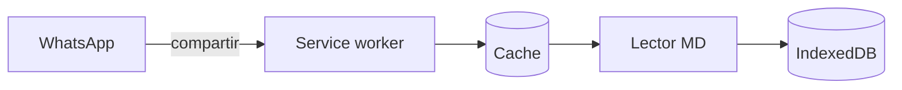
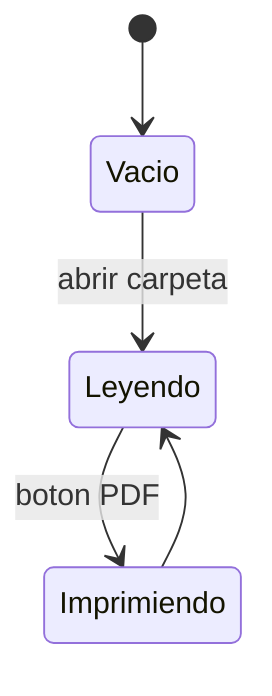

# Lector MD — documento de ejemplo

Este archivo es el manual y la demostración al mismo tiempo: cada sección usa
la sintaxis que está explicando. Si lo estás leyendo **dentro del lector**, lo
que ves es exactamente lo que el lector entiende.

Si lo estás leyendo en GitHub, algunas cosas se van a ver distinto. Esa es
justamente la gracia: descargalo y abrilo en el lector.


## Qué es esto

Un lector de archivos Markdown que funciona **sin internet** y **sin subir nada
a ningún lado**. El archivo se lee en tu propia máquina y se muestra ahí mismo.

Es un solo `index.html`. No hay servidor que procese tus documentos, no hay
cuenta, no hay sincronización. Podés copiar ese único archivo a un pendrive y
leer tus `.md` en cualquier computadora con navegador.

Instalado como app tiene dos cosas más:

- En **Android** aparece en el menú *Compartir*: mandás un `.md` desde WhatsApp,
  Drive o el explorador y se abre acá.
- En **escritorio** aparece en *Abrir con*.

## Todo lo que hace, de un vistazo

| | |
|---|---|
| **Abrir** | una carpeta entera con sus subcarpetas, archivos sueltos, o arrastrando y soltando |
| **Desde otras apps** | en Android por el menú *Compartir*; en escritorio, por *Abrir con* |
| **Markdown** | encabezados, listas anidadas, tablas, código, citas, énfasis, enlaces |
| **Fórmulas** | con KaTeX si hay conexión, en Unicode si no |
| **Diagramas** | con Mermaid, que se baja sólo si el archivo tiene alguno |
| **Navegar** | índice automático de niveles 1 a 3, y `Alt`+`J` / `Alt`+`K` entre archivos |
| **Buscar** | dentro del documento abierto, desde dos caracteres, con resaltado |
| **Imprimir** | o guardar en PDF, con estilos propios para papel |
| **Ver** | tema claro u oscuro, interlineado cómodo o compacto |
| **Recordar** | qué archivos cargaste, cuál leías y en qué parte de cada uno |
| **Funcionar** | sin conexión, sin servidor, con un solo archivo que podés llevar a cualquier lado |
| **Actualizarse** | sola, sin perder lo que tenías abierto |

## Cómo abrir archivos

### Desde la app

Tenés tres caminos, todos equivalentes:

1. **Abrir carpeta** — elegís una carpeta entera y lista todos los `.md` que haya
   adentro, incluidos los de subcarpetas. Es la opción recomendada.
2. **Abrir archivos sueltos** — elegís uno o varios archivos puntuales.
3. **Arrastrar y soltar** — tirás los archivos sobre la zona de lectura.

En pantallas chicas el panel lateral se esconde; el botón **☰** de la barra
superior lo abre.

### Desde otra app, en el celular

En el chat o en el explorador, tocá el ícono de **compartir** del archivo y
elegí **Lector MD** en la lista.

> Es **compartir**, no *abrir con*. En Android, Chrome no implementa la API que
> haría falta para aparecer en *abrir con*, así que el camino es el otro.

## Qué entiende del Markdown

### Texto

Se puede poner *cursiva* con asteriscos o _con guiones bajos_, **negrita**,
***negrita y cursiva*** juntas, ~~texto tachado~~ y `código en línea`.

Los párrafos se separan con una línea en blanco. Un salto de línea suelto
**no** corta el párrafo: las líneas se unen, como en el Markdown clásico.

Las citas llevan un signo mayor adelante:

> Una cita ocupa su propio bloque y puede tener **formato adentro**.
> Incluso listas, tablas o código.

Para separar secciones, tres guiones:

---

### Encabezados

De `#` a `######`. Los de nivel 1 a 3 arman el índice **En este archivo** del
panel lateral, que aparece sólo si hay más de dos.

### Listas

Las viñetas aceptan `-`, `*` o `+`:

- Un ítem
- Otro ítem
  - Anidado un nivel
  - Otro anidado
- Vuelta al primer nivel

Las numeradas aceptan `1.` o `1)`:

1. Primer paso
2. Segundo paso
   1. Subpaso
   2. Otro subpaso
3. Tercer paso

### Tablas

Se escriben con barras verticales y una línea de guiones debajo del
encabezado. Las tablas anchas scrollean solas en horizontal.

| Elemento | Sintaxis | Aparece en el índice |
|---|---|---|
| Encabezado | `#` a `######` | niveles 1 a 3 |
| Cita | signo mayor | no |
| Tabla | barras y guiones | no |
| Fórmula | `$$` o valla `math` | no |
| Diagrama | valla `mermaid` | no |

### Código

Con vallas de tres acentos graves, y le podés poner el lenguaje al lado:

```js
const lector = {
  archivos: [],
  offline: true
};
```

También sirve un bloque indentado con cuatro espacios:

    esto también es código
    por estar indentado

### Fórmulas

Las fórmulas en línea van entre signos pesos, como $E = mc^2$. Las de bloque
van entre doble signo pesos:

$$\int_0^1 x^2\,dx = \frac{1}{3}$$

También funciona una valla con lenguaje `math`, `latex` o `tex`, al estilo de
GitHub:

```math
\sum_{i=1}^{n} i = \frac{n(n+1)}{2}
```

Si hay conexión se dibujan con **KaTeX**: tipografía matemática de verdad. Si
no, caen a una aproximación en Unicode que se lee bien igual.

### Diagramas

Una valla con lenguaje `mermaid` se dibuja como diagrama:



Sirven los tipos de **Mermaid**: flujos, secuencias, clases, estados, Gantt.
Los diagramas siguen el tema del lector, y al imprimir se redibujan en claro
para que salgan legibles en papel.



La librería de diagramas pesa unos 3 MB, así que **se baja recién cuando abrís
un archivo que tiene alguno**. Después queda guardada y funciona sin conexión.
Si no se puede bajar, el bloque se queda mostrando el código del diagrama, que
se lee igual.

### Enlaces e imágenes

Un [enlace común](https://mdreader.jhproyectos.com.ar), y una dirección suelta
que se convierte sola: https://github.com/JHProyectos/mdreader-pwa

Las imágenes van con la sintaxis de admiración y se achican para entrar en la
columna. Ojo: una imagen con ruta relativa sólo se ve si esa ruta existe donde
estás abriendo el archivo. El lector recibe el texto del `.md`, no la carpeta.

Los wiki-links `[[nombre]]` se muestran como código, no como enlace: el lector
no tiene forma de saber a qué archivo apuntan.

## Codificación de los archivos

Esta es la parte que más problemas suele dar, así que conviene ser preciso.

### Texto

Los archivos se leen **siempre como UTF-8**. No hay detección automática de
codificación ni forma de elegir otra.

En la práctica no vas a notarlo, porque UTF-8 es lo que usan hoy todos los
editores. Pero si un archivo viejo fue guardado en *Latin-1* o
*Windows-1252*, los acentos y las eñes van a aparecer rotos.

La solución es del lado del archivo, no del lector: abrilo en cualquier editor
y guardalo de nuevo como UTF-8.

### Finales de línea

Da igual cómo estén guardados. El lector normaliza los tres estilos:

| Estilo | De dónde viene |
|---|---|
| `LF` | Linux, macOS |
| `CRLF` | Windows |
| `CR` | Mac clásico |

### Extensiones

Se aceptan tres: `.md`, `.markdown` y `.txt`. Cuando abrís una carpeta, el
lector filtra por esas extensiones e ignora todo lo demás.

Un `.txt` se procesa como Markdown igual que los otros. Si adentro no tiene
sintaxis de Markdown, simplemente se ve como texto.

## Leer, buscar e imprimir

### Buscar

El campo de arriba busca en el documento abierto y resalta las coincidencias,
desde dos caracteres en adelante. No busca en los otros archivos de la lista,
sólo en el que estás leyendo.

El texto de los diagramas queda afuera de la búsqueda: un diagrama dibujado es
una imagen vectorial, y resaltar ahí adentro haría desaparecer el texto.

### Cómodo o compacto

El botón **⇕** del panel alterna entre dos densidades de lectura. No cambia el
tamaño de la letra: cambia el aire, o sea el interlineado y la separación entre
párrafos, títulos y bloques.

| | Cómodo | Compacto |
|---|---|---|
| Interlineado | 1.6 | 1.38 |
| Entre párrafos | amplio | mínimo |
| Margen de la hoja | generoso | ajustado |

**Cómodo** viene puesto de fábrica y es para leer en pantalla sin cansarte.
**Compacto** aprieta todo para que entre más contenido de una: sirve para
revisar un documento largo de un vistazo. La elección queda guardada, así que
la próxima vez abrís como lo dejaste.

Al **imprimir siempre sale compacto**, estés como estés en pantalla. Es a
propósito: en papel el aire de más se traduce en hojas de más.

El botón **◐** de al lado hace lo mismo con el tema, entre claro y oscuro, y
también se acuerda de tu elección.

### Imprimir o guardar en PDF

El botón **⎙ PDF** abre el diálogo de impresión del navegador, que también
sirve para guardar en PDF. Hay una hoja de estilos aparte para impresión, así
que en papel no salen ni el panel lateral ni la barra superior.

Para que numere las hojas, en el diálogo abrí *Más opciones* y activá
*Encabezados y pies de página*. Eso lo hace el navegador; no se puede pedir
desde el documento.

### Atajos

| Atajo | Qué hace |
|---|---|
| `Ctrl` + `F` | ir al campo de búsqueda |
| `Esc` | limpiar la búsqueda |
| `Alt` + `J` | archivo siguiente |
| `Alt` + `K` | archivo anterior |

### Lo que queda guardado

Los archivos que cargaste, cuál estabas leyendo y en qué parte de cada uno
ibas: todo eso se guarda en tu navegador y vuelve tal cual la próxima vez,
incluso después de una actualización de la app.

Se guarda en tu máquina, no en un servidor. **Limpiar todo** vacía la lista
del lector, y nunca borra archivos de tu disco.

## Pedirle a una IA un archivo que use todo

Si querés probar el lector con algo tuyo, la forma más rápida es pedirle a
ChatGPT, Claude o el que uses que te genere un `.md` que ejercite todas las
funciones. El problema de pedirlo suelto es que los modelos escriben Markdown
"de GitHub", con cosas que este lector no interpreta, y el resultado se ve a
medias.

Copiá este pedido, cambiá el tema por el que quieras y pegalo tal cual:

```
Necesito un archivo Markdown de prueba, en español, sobre CAMBIÁ ESTO POR TU TEMA.

Tiene que usar todo lo siguiente, porque lo voy a abrir en un lector que soporta
exactamente esta sintaxis:

- Encabezados de nivel 1 a 3, al menos cinco en total, para que se arme un índice
- Párrafos normales, con negrita, cursiva, tachado y código en línea
- Una lista con viñetas que tenga un nivel de anidado, y una lista numerada
- Una cita, con algo en negrita adentro
- Una tabla de tres columnas con encabezado
- Un bloque de código con el lenguaje declarado
- Una fórmula matemática en línea y otra de bloque, en LaTeX
- Un diagrama Mermaid de flujo y otro de secuencia
- Una regla horizontal

No uses nada de esto, porque el lector no lo interpreta y queda a la vista como
texto crudo: listas de tareas con casillas para tildar, notas al pie, etiquetas
HTML sueltas, enlaces por referencia con la definición al final, ni encabezados
subrayados en vez de encabezados con numeral.

Devolvémelo como un único bloque de Markdown crudo, listo para guardar como
archivo .md en UTF-8.
```

Guardá la respuesta como `prueba.md` y abrila con **Abrir archivos sueltos**. Si
algo se ve como texto crudo en vez de renderizado, es casi seguro que el modelo
metió alguna de las cosas de la lista de abajo.

## Lo que no hace

Es un lector deliberadamente chico, con un parser propio. Estas cosas de
Markdown no están:

- **Listas de tareas.** Las casillas de tildar se ven como texto.
- **Notas al pie.** Quedan como están escritas.
- **HTML adentro del Markdown.** Se muestra como texto, no se interpreta. Es a
  propósito: los archivos llegan de afuera y no se ejecuta nada de lo que traen.
- **Enlaces por referencia**, con la definición aparte al final.
- **Encabezados subrayados**, los que se marcan con guiones o iguales debajo
  del texto. Usá `#`.
- **Editar.** Es un lector: muestra archivos, no los modifica.

---

Si algo de acá no se ve como esperabas, el lugar para contarlo es
https://github.com/JHProyectos/mdreader-pwa
