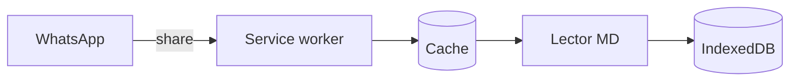
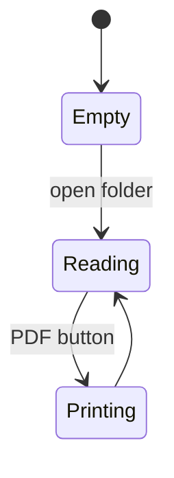

# Lector MD — sample document

This file is the manual and the demo at the same time. Each section first
shows **how something is written**, in a box with the text exactly as it goes
in the file, and then **how it looks** in the reader.

If you're reading this on GitHub, some results will look different: that's
the whole point. Download it and open it in the reader.


[TOC]

## What this is

A Markdown file reader that works **offline** and **without uploading anything
anywhere**. The file is read on your own machine and shown right there.

It's a single `index.html`. There's no server processing your documents, no
account, no sync. You can copy that one file to a USB stick and read your `.md`
files on any computer with a browser.

Installed as an app, it does two more things:

- On **Android** it shows up in the *Share* menu: send a `.md` from WhatsApp,
  Drive or the file manager and it opens here.
- On **desktop** it shows up in *Open with*.

## Everything it does, at a glance

| | |
|---|---|
| **Open** | a whole folder with its subfolders, individual files, or by dragging and dropping |
| **From other apps** | on Android through the *Share* menu; on desktop, through *Open with* |
| **Markdown** | headings, nested lists, tables, code, quotes, emphasis, links |
| **Formulas** | with KaTeX when online, in Unicode when not |
| **Diagrams** | with Mermaid, downloaded only if the file has one |
| **Code** | colored for JavaScript, TypeScript, Python, HTML, CSS, Java, C and C# |
| **Charts** | bar, line, area, scatter and pie charts, from a data table written in the file |
| **Navigate** | section index in the side panel, a table of contents inside the document with `[TOC]`, and `Alt`+`J` / `Alt`+`K` between files |
| **Search** | inside the open document, from two characters, with highlighting |
| **Print** | or save as PDF, with a stylesheet made for paper |
| **View** | light or dark theme, comfortable or compact line spacing |
| **Language** | English or Spanish, following the browser, with a button to switch |
| **Remember** | which files you loaded, which one you were reading and where you were in each |
| **Work** | offline, serverless, from a single file you can take anywhere |
| **Update** | on its own, without losing what you had open |

## How to open files

### From the app

There are three ways, all equivalent:

1. **Open folder** — pick a whole folder and it lists every `.md` inside it,
   including those in subfolders. This is the recommended option.
2. **Open individual files** — pick one or more specific files.
3. **Drag and drop** — drop the files onto the reading area.

On small screens the side panel is hidden; the **☰** button in the top bar
opens it.

### From another app, on your phone

In the chat or the file manager, tap the file's **share** icon and choose
**Lector MD** from the list.

> It's **share**, not *open with*. On Android, Chrome doesn't implement the API
> needed to appear in *open with*, so this is the way in.

## What Markdown it understands

Each example has two parts: the box with the text as it's written in the file
and, under **It looks like this**, the result.

### Text

~~~markdown
You can write *italics* with asterisks or _with underscores_, **bold**,
***bold and italics*** together, ~~strikethrough~~ and `inline code`.
~~~

It looks like this:

You can write *italics* with asterisks or _with underscores_, **bold**,
***bold and italics*** together, ~~strikethrough~~ and `inline code`.

Paragraphs are separated by a blank line. A single line break does **not**
end the paragraph: the lines are joined, as in classic Markdown. That's why
the two lines of the example show up as one.

### Quotes

~~~markdown
> A quote is a block of its own and can have **formatting inside**.
~~~

It looks like this:

> A quote is a block of its own and can have **formatting inside**.

### Separators

Three dashes alone on a line draw a horizontal rule:

~~~markdown
---
~~~

It looks like this:

---

### Headings

~~~markdown
# Document title
## Section
### Subsection
~~~

They go from `#` to `######`: the more hashes, the smaller the heading. There's
no separate result because the headings of this very document are written this
way; this one, for example, uses `###`.

Levels 1 to 3 build the **In this file** index in the side panel and the table
of contents explained next.

### Table of contents

~~~markdown
[TOC]
~~~

Write `[TOC]` alone on a line, wherever you want it to appear. The list of
level 1 to 3 headings is built there, with a link to each section. The result
is the **Contents** box at the top of this file.

If the document has a single `#`, it's taken as the title and not listed.
`[[_TOC_]]` works too, as in GitLab. Unlike the index in the side panel, the
table of contents is printed.

### Lists

~~~markdown
- An item
- Another item
  - Nested one level
  - Another nested one
- Back to the first level

1. First step
2. Second step
   1. Substep
   2. Another substep
3. Third step
~~~

It looks like this:

- An item
- Another item
  - Nested one level
  - Another nested one
- Back to the first level

1. First step
2. Second step
   1. Substep
   2. Another substep
3. Third step

Bullets accept `-`, `*` or `+`, and numbered items `1.` or `1)`.

### Tables

~~~markdown
| Element | Syntax | Shows in the index |
|---|---|---|
| Heading | `#` to `######` | levels 1 to 3 |
| Quote | greater-than sign | no |
| Formula | `$$` or a `math` fence | no |
~~~

It looks like this:

| Element | Syntax | Shows in the index |
|---|---|---|
| Heading | `#` to `######` | levels 1 to 3 |
| Quote | greater-than sign | no |
| Formula | `$$` or a `math` fence | no |

The row of dashes under the header is required. Wide tables scroll
horizontally on their own.

### Code

With fences of three backticks. If you put the language next to the opening
fence, keywords, strings, numbers and comments are highlighted:

~~~markdown
```python
def average(values):
    """Return the average, or None if the list is empty."""
    if not values:
        return None
    return sum(values) / len(values)
```
~~~

It looks like this:

```python
def average(values):
    """Return the average, or None if the list is empty."""
    if not values:
        return None
    return sum(values) / len(values)
```

These are the highlighted languages and how to write each one:

| Language | Next to the fence |
|---|---|
| JavaScript | `js`, `javascript`, `json` |
| TypeScript | `ts`, `typescript` |
| Python | `py`, `python` |
| HTML and XML | `html`, `xml`, `svg` |
| CSS | `css` |
| Java | `java` |
| C | `c`, `h` |
| C# | `cs`, `csharp`, `c#` |

The colors come from **Prism**, which weighs about 33 KB and is downloaded the
first time you open a file with code in one of these languages; after that it
stays cached. They follow the reader's theme and print with the light theme's
colors. Offline, or with any other language, the block looks the same but in a
single color.

A block indented with four spaces also works, and stays uncolored:

~~~markdown
    this is code too
    because it's indented
~~~

It looks like this:

    this is code too
    because it's indented

### Formulas

**Inline** formulas go between dollar signs, inside a sentence:

~~~markdown
The rest energy is $E = mc^2$.
~~~

It looks like this:

The rest energy is $E = mc^2$.

**Block** formulas go on their own line, between double dollar signs:

~~~markdown
$$\int_0^1 x^2\,dx = \frac{1}{3}$$
~~~

It looks like this:

$$\int_0^1 x^2\,dx = \frac{1}{3}$$

A fence with the language `math`, `latex` or `tex` works too, GitHub style:

~~~markdown
```math
\sum_{i=1}^{n} i = \frac{n(n+1)}{2}
```
~~~

It looks like this:

```math
\sum_{i=1}^{n} i = \frac{n(n+1)}{2}
```

When online they're drawn with **KaTeX**: real math typesetting. When not,
they fall back to a Unicode approximation that still reads well.

### Diagrams

A fence with the language `mermaid` is drawn as a diagram:

~~~markdown

~~~

It looks like this:


Every **Mermaid** type works: flowcharts, sequence, class, state, Gantt. For
example, a state diagram:

~~~markdown

~~~

It looks like this:


Diagrams follow the reader's theme, and are redrawn in light colors when
printing so they stay legible on paper.

The diagram library weighs about 3 MB, so **it's only downloaded when you open
a file that has a diagram**. After that it stays cached and works offline. If
it can't be downloaded, the block keeps showing the diagram's source, which
still reads fine.

### Charts

A fence with the language `chart` (or `grafico`) draws a bar, line, area,
scatter or pie chart. Options go first, one per line; then the data. The first
data row is the header: the first column holds the categories and each of the
following ones is a series.

~~~markdown
```chart
type: bar
title: Study hours per week
unit: h

Week, Calculus, Programming
1, 6, 4
2, 5, 7
3, 8, 6
4, 7, 9
```
~~~

It looks like this:

```chart
type: bar
title: Study hours per week
unit: h

Week, Calculus, Programming
1, 6, 4
2, 5, 7
3, 8, 6
4, 7, 9
```

A line chart is written the same way, with `type: line`:

~~~markdown
```chart
type: line
title: Response time under load
unit: ms

Users, Cached, Uncached
10, 12, 35
50, 14, 80
100, 15.5, 160
200, 18, 340
400, 25, 700
```
~~~

It looks like this:

```chart
type: line
title: Response time under load
unit: ms

Users, Cached, Uncached
10, 12, 35
50, 14, 80
100, 15.5, 160
200, 18, 340
400, 25, 700
```

An **area** chart is a line with the surface filled down to zero. It suits a
running total, where what you read is how much has piled up:

~~~markdown
```chart
type: area
title: Pages read this month
unit: pp.

Week, Read
1, 40
2, 95
3, 130
4, 210
```
~~~

It looks like this:

```chart
type: area
title: Pages read this month
unit: pp.

Week, Read
1, 40
2, 95
3, 130
4, 210
```

A **scatter** chart doesn't join the points. If the categories are numbers the
horizontal axis is numeric too and each point lands where it belongs, so a jump
in the data shows up as a gap instead of being spread out evenly:

~~~markdown
```chart
type: scatter
title: Grade by hours of study

Hours, Grade
2, 4
3, 5
5, 7
6, 6
9, 9
12, 10
```
~~~

It looks like this:

```chart
type: scatter
title: Grade by hours of study

Hours, Grade
2, 4
3, 5
5, 7
6, 6
9, 9
12, 10
```

A **pie** chart splits a total between its categories, with each slice's share
next to it. It takes a single value column, no negatives, and up to eight
slices:

~~~markdown
```chart
type: pie
title: Where the visits come from

Source, Visits
Search, 540
Direct, 260
Social, 150
Links, 50
```
~~~

It looks like this:

```chart
type: pie
title: Where the visits come from

Source, Visits
Search, 540
Direct, 260
Social, 150
Links, 50
```

| Option | What it does | If you leave it out |
|---|---|---|
| `type` | `bar`, `line`, `area`, `scatter` or `pie` | bar |
| `title` | text above the chart | no title |
| `unit` | text above the vertical axis and next to each value | nothing |
| `min`, `max` | a value the axis must include, such as `min: 0` | worked out automatically |

A few details:

- The options are also understood in Spanish: `tipo`, `titulo` and `unidad`,
  with `barras`, `lineas`, `area`, `dispersion` or `torta`.
- Columns are separated by commas. If your numbers use a **decimal comma**,
  separate the columns with semicolons instead.
- Tabs work too, which is what you get when copying cells from a spreadsheet,
  and so do vertical bars: a Markdown table pasted inside the fence works as is.
- An empty cell leaves a gap: the bar doesn't appear and the line breaks.
- Up to 8 series fit, one per color. With more, split the chart. A pie is
  capped at 8 slices, for the same reason.
- Bars and areas always start at zero, because what you read is the size; lines
  and points do so only when the data lands near it.
- Numbers go without thousands separators: `1234`, not `1,234`.

Hovering with the mouse, or tapping with a finger, shows the values for that
category, and on a pie the share as well. Below, **Show data** shows the same
information as a table. If the data has an error, the block keeps showing the
fence's text, with a note on what went wrong.

Unlike diagrams, charts are drawn by the reader itself, without downloading
anything: they work offline from the very first moment.

### Links and images

~~~markdown
A [regular link](https://mdreader.jhproyectos.com.ar), and a bare address
that turns into a link on its own: https://github.com/JHProyectos/mdreader-pwa
~~~

It looks like this:

A [regular link](https://mdreader.jhproyectos.com.ar), and a bare address
that turns into a link on its own: https://github.com/JHProyectos/mdreader-pwa

Images start with an exclamation mark, and the text in square brackets is the
alternative text. The illustration at the top is written like this:

~~~markdown

~~~

They shrink to fit the column. Note: an image with a relative path only shows
up if that path exists where you're opening the file. The reader receives the
text of the `.md`, not its folder.

Wiki-links are shown as code, not as links, because the reader has no way of
knowing which file they point to:

~~~markdown
See also [[another note]].
~~~

It looks like this:

See also [[another note]].

## File encoding

This is the part that usually causes the most trouble, so it pays to be
precise.

### File text

Files are **always read as UTF-8**. There's no automatic encoding detection
and no way to choose another one.

In practice you won't notice, because UTF-8 is what every editor uses today.
But if an old file was saved as *Latin-1* or *Windows-1252*, accented letters
will show up broken.

The fix is on the file's side, not the reader's: open it in any editor and save
it again as UTF-8.

### Line endings

It doesn't matter how they were saved. The reader normalizes all three styles:

| Style | Where it comes from |
|---|---|
| `LF` | Linux, macOS |
| `CRLF` | Windows |
| `CR` | classic Mac |

### Extensions

Three are accepted: `.md`, `.markdown` and `.txt`. When you open a folder, the
reader filters by those extensions and ignores everything else.

A `.txt` is processed as Markdown just like the others. If there's no Markdown
syntax inside, it simply shows as text.

## Reading, navigating, searching and printing

### Navigating

To move around a long document there are two indexes:

- **In this file**, in the side panel, lists the level 1 to 3 headings. Tap
  one and the document jumps to that section. It shows up when there are more
  than two headings; on a phone it's inside the panel that **☰** opens.
- **The table of contents** goes inside the document itself, wherever `[TOC]`
  is written. It's the **Contents** box at the top of this file, and its links
  also take you to each section. Unlike the panel, it's printed. How to write
  it is under *Table of contents*, above.

To go from one file to another, tap its name in the list or use `Alt` + `J`
for the next one and `Alt` + `K` for the previous one. Each file remembers how
far you read, so when you come back you're in the same place.

### Searching

The field at the top searches the open document and highlights the matches,
from two characters on. It doesn't search the other files in the list, only
the one you're reading.

Diagram text is left out of the search: a drawn diagram is a vector image, and
highlighting inside it would make the text disappear. For the same reason, in
charts the title, the legend and the **Show data** table (when open) are
searched, but not the axis numbers.

### Comfortable or compact

The **⇕** button in the panel switches between two reading densities. It
doesn't change the font size: it changes the spacing, meaning the line height
and the space between paragraphs, headings and blocks.

| | Comfortable | Compact |
|---|---|---|
| Line height | 1.6 | 1.38 |
| Between paragraphs | generous | minimal |
| Page margin | generous | tight |

**Comfortable** is the default and is meant for reading on screen without
getting tired. **Compact** tightens everything so more content fits at once:
it's useful for skimming a long document. The choice is remembered, so next
time it opens the way you left it.

**Printing is always compact**, whatever you use on screen. That's on purpose:
on paper, extra spacing turns into extra pages.

The **◐** button next to it does the same for the theme, between light and
dark, and also remembers your choice.

### Language

The interface and this help come in English and Spanish. By default the
browser's language is used; the **ES** button in the panel switches to
Spanish and, from there, **EN** switches back to English. The choice is
remembered.

The language doesn't touch your files: each document is shown exactly as it's
written.

### Printing or saving as PDF

The **⎙ PDF** button opens the browser's print dialog, which also lets you save
as PDF. There's a separate stylesheet for printing, so neither the side panel
nor the top bar end up on paper.

To number the pages, open *More settings* in the dialog and turn on *Headers
and footers*. The browser does that; it can't be requested from the document.
For the same reason, the table of contents is printed but without page
numbers.

### Shortcuts

| Shortcut | What it does |
|---|---|
| `Ctrl` + `F` | go to the search field |
| `Esc` | clear the search |
| `Alt` + `J` | next file |
| `Alt` + `K` | previous file |

### What gets remembered

The files you loaded, which one you were reading and how far along you were in
each: all of that is stored in your browser and comes back as it was next time,
even after an app update.

It's stored on your machine, not on a server. **Clear all** empties the
reader's list, and never deletes files from your disk.

## Asking an AI for a file that uses everything

If you want to try the reader with something of your own, the quickest way is
to ask ChatGPT, Claude or whichever you use to generate a `.md` that exercises
every feature. The problem with asking loosely is that models write
"GitHub-flavored" Markdown, with things this reader doesn't interpret, and the
result only half renders.

Copy this request, change the topic to whatever you want and paste it as is:

```
I need a sample Markdown file, in English, about CHANGE THIS TO YOUR TOPIC.

It must use everything below, because I'll open it in a reader that supports
exactly this syntax:

- Level 1 to 3 headings, at least five in total, so an index gets built
- A line with just [TOC] right after the title, for the table of contents
- Regular paragraphs with bold, italics, strikethrough and inline code
- A bulleted list with one level of nesting, and a numbered list
- A blockquote with something in bold inside
- A three-column table with a header
- A code block with its language declared, one of: js, ts, python, html, css, java, c or csharp
- An inline math formula and a block one, in LaTeX
- A Mermaid flowchart and a sequence diagram
- One chart of each kind, each in a fence with the language chart: first the lines "type: ..." (bar, line, area, scatter or pie) and "title: ...", then an empty line and the data separated by commas, with the first row as the header and the first column as the categories. The pie takes a single value column, all positive, and up to eight rows; on the scatter the categories should be numbers
- A horizontal rule

Don't use any of the following, because the reader doesn't interpret it and it
shows up as raw text: task lists with checkboxes, footnotes, raw HTML tags,
reference-style links with the definition at the end, or underlined headings
instead of headings with hashes.

Give it back to me as a single block of raw Markdown, ready to save as a UTF-8
.md file.
```

Save the answer as `test.md` and open it with **Open individual files**. If
something shows as raw text instead of rendered, the model almost certainly
slipped in one of the things from the list below.

## What it doesn't do

It's a deliberately small reader, with its own parser. These Markdown features
aren't there:

- **Task lists.** Checkboxes show up as text.
- **Footnotes.** They stay as written.
- **HTML inside Markdown.** It's shown as text, not interpreted. That's on
  purpose: files come from outside, and nothing they carry gets executed.
- **Reference-style links**, with the definition separately at the end.
- **Underlined headings**, the ones marked with dashes or equals signs under
  the text. Use `#`.
- **Editing.** It's a reader: it shows files, it doesn't change them.

---

If something here doesn't look the way you expected, the place to report it is
https://github.com/JHProyectos/mdreader-pwa
